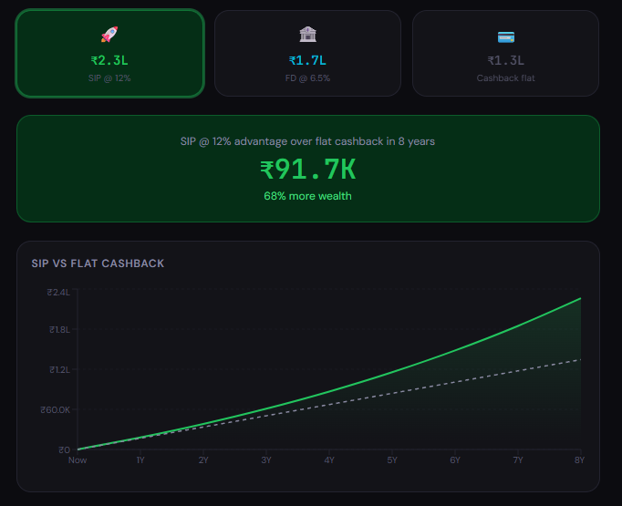
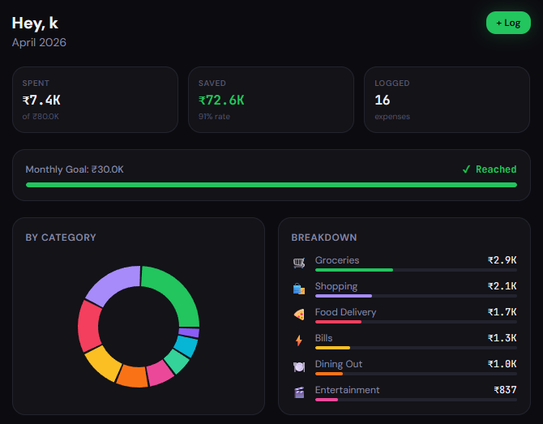
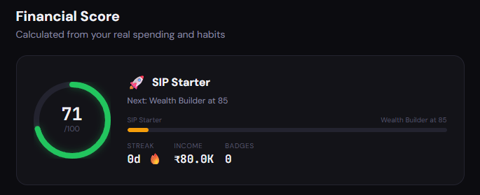

# K2 Wealth — Financial Empowerment for Gen-Z

> **Team K2 · Finvasia Hackathon 2026 · Chitkara University**  
> PS2 — Cashback Dependency · Track 1: Payments & Digital Banking

**Live app:** [Open K2 Wealth](https://k2finances.netlify.app)

---

## What this project is

K2 Wealth is a small **personal finance web app** aimed at Gen-Z: you set who you are (name, monthly income, savings goal), log spending by category, and see month summaries, a simple **financial score**, **AI-style nudges** (Gemini when an API key is set, otherwise rule-based text), and a **Growth** view that compares monthly SIP and FD assumptions against a flat cashback baseline.

Nothing is “filled in for you” with fake numbers. Empty states explain what is missing (for example, no income yet, or no expenses this month). A **demo path** can seed realistic sample expenses so judges or teammates can explore the UI without manual data entry.

The hackathon angle is **cashback dependency**: the product encourages awareness of spending patterns and tradeoffs between saving, spending, and default cashback behavior.

---

## Preview

### Growth Comparison (SIP vs Cashback)
*Shows how consistent investing outperforms flat cashback*



### Dashboard Overview
*Real-time financial insights and spending breakdown*



### Financial Score System
*Tracks user financial health and progress*



## How data and accounts work

The app keeps a **single client-side store** (`src/store/index.js`, Zustand + Immer) that holds the signed-in user id, profile, expenses, and nudges.

You can run it in two modes:

- **With Supabase** (`VITE_SUPABASE_URL` and `VITE_SUPABASE_ANON_KEY`): users sign in with **email and password**. Profile and rows in `profile`, `expenses`, and `nudges` are scoped by `user_id` and protected with **row-level security** in Postgres. The same data is **mirrored in `localStorage`** under keys prefixed with `k2:` so the UI can recover quickly and survive flaky reads.
- **Without Supabase**: the app generates a **stable local UUID** and stores everything in `localStorage` only. Useful for offline demos or when you do not want to run a backend.

In both modes, **your data is not mixed with anyone else’s**; there is no shared demo pool tied to a global user.

---

## What you see in the product

| Area | What it is for |
|------|----------------|
| **Onboarding** | Collects name, income, and savings goal. With Supabase, the first step is account creation or sign-in; new accounts still walk through the profile steps until complete. |
| **Log** | Quick logging: pick a category, enter an amount, save. You can load **sample expenses** when the list is empty (or when using cloud sync) to populate charts. Rows support **edit** (pre-fills the form, then **Update**) and **delete** with confirmation. |
| **Dashboard** | This month at a glance: totals, category pie, recent nudges, and a score preview when the data supports it. |
| **Growth** | Investment-style projections: **SIP** vs **FD** vs **flat cashback**, with a slider and optional typed monthly amount. |
| **Score** | A 1–100 score, short insights, badges, and a small panel to adjust income and savings goal. |

The main shell uses a **fixed sidebar on desktop** and a **bottom navigation bar on mobile** so navigation stays visible while scrolling.

---

## Tech stack

- **React 18** with **Vite** for build and dev server  
- **React Router** for client-side routes  
- **Tailwind CSS** for layout and styling  
- **Zustand** (+ Immer) for application state  
- **Supabase JS** for optional auth and Postgres sync  
- Optional **Gemini** HTTP calls for richer nudge wording  

---

## Repository layout

At a high level, **`src/App.jsx`** defines routes and an **onboarding gate**: some paths are public (`/onboarding`, `/login`), while the rest render inside **`Shell`**, which wraps the main app chrome (sidebar / bottom nav) and nested routes for Log, Dashboard, Growth, and Score.

**`src/store/index.js`** is the **authoritative place for business rules**: loading the user, reading and writing the profile, listing and mutating expenses, nudges, streaks, and badges. Pages should prefer selectors and actions from the store rather than duplicating finance logic.

**`src/lib/`** holds integrations: **`supabase.js`** (client and “who is the user?”), **`gemini.js`** (prompting and fallbacks), **`demoSeed.js`** (structured fake history for demos). **`src/utils/finance.js`** holds shared numeric helpers, categories, and pieces of the scoring story used in more than one screen.

**`supabase/schema-reset.sql`** is the **reference database script** for Supabase: it drops and recreates the app tables (`profile`, `expenses`, `nudges`) and installs RLS policies that use explicit **`WITH CHECK`** clauses so inserts and updates behave correctly under PostgreSQL. Use it when you want a clean schema that matches what the client expects.

```
src/
├── App.jsx                 # Routes, onboarding guard, auth listener → store init
├── main.jsx                # React root
├── index.css               # Global styles / Tailwind entry
├── store/
│   └── index.js            # Zustand store: profile, expenses, nudges, Supabase + LS
├── lib/
│   ├── supabase.js         # Supabase client; session vs local UUID
│   ├── gemini.js           # Nudge generation + non-LLM fallbacks
│   └── demoSeed.js         # Sample expense generator
├── utils/
│   └── finance.js          # Categories, triggers, score-related helpers
├── components/
│   ├── layout/Shell.jsx    # App chrome and outlet for child routes
│   └── ui/                 # Buttons, cards, inputs, etc.
└── pages/
    ├── Onboarding.jsx      # Auth + profile wizard (and demo entry)
    ├── Login.jsx           # Redirect helper for legacy `/login` URL
    ├── LogExpense.jsx      # Primary logging UI
    ├── Dashboard.jsx       # Month view, nudges, charts
    ├── Growth.jsx          # SIP / FD / cashback comparison
    └── Score.jsx           # Score ring, insights, profile edits
|
├── screenshots/
│ ├── growth.png
│ ├── dashboard.png
│ └── score.png
├── supabase/
│ └── schema-reset.sql       # Full DDL + RLS reset for Supabase SQL editor
```

---

## How state moves when you use the app

When the app boots—or when Supabase reports a **signed-in** or **refreshed** session—the store’s **`init`** routine resolves the current user id, then loads **profile**, **expenses**, and **nudges** from Supabase when configured, otherwise from `localStorage`. After that, screens simply read from the store.

Logging an expense runs **`addExpense`**: the list updates immediately, the mirror keys in `localStorage` update, and if Supabase is on, a row is inserted remotely. Related logic may bump **streak** and **badges**, and can enqueue a **nudge** (Gemini or fallback) based on the latest month’s totals.

Profile edits (onboarding, Score settings, or streak maintenance) go through **`saveProfile`**, which merges into the in-memory profile, updates `localStorage`, and upserts the **`profile`** row in Supabase without sending nulls for fields you did not intend to clear—so partial updates do not accidentally erase name or income.

---

## Score and Growth (reference math)

The **score** is a weighted blend of savings rate, “impulsive” category share, logging streak, and whether a savings goal exists, clamped to 1–100:

```
base = 40
+ savingsRate × 40       (income - spent) / income
- impulsiveRatio × 25    (food delivery + entertainment + shopping) / total
+ min(streak, 10)        logging habit bonus
+ 5 if savings goal set
= clamped [1, 100]
```

**Growth** uses three illustrative curves (not investment advice): SIP at **12% annual** with monthly compounding, a simplified **FD at 6.5% annual**, and **flat cashback** with no compounding. The UI documents the exact formulas inline; at a glance:

```
SIP:   FV = P × [(1.01^n − 1) / 0.01] × 1.01   (P monthly, n months, 1% / month)
FD:    FV ≈ P × 12 × years × (1 + (0.065/12) × (years×12/2))   (simplified model)
Cash:  FV = P × 12 × years
```

---

## Local development (clone, database SQL, env, run)

Use this order the first time you set up the project.

### 1. Clone the repository and install dependencies

```bash
git clone <repo-url>
cd k2-wealth
npm install
```

The folder name may match your Git remote (for example `k2-finvasia`); `cd` into whatever directory `git clone` created.

### 2. (Optional) Create tables and policies in Supabase

Skip this block if you are running **localStorage-only** mode without Supabase.

1. In [Supabase](https://supabase.com), create a project (or open an existing one). Under **Project Settings → API**, copy the **Project URL** and the **anon public** key for step 4.
2. In the Supabase dashboard, open **SQL Editor**, click **New query**.
3. On your machine, open the cloned repo file **`supabase/schema-reset.sql`** in any editor, select **all** of its contents, copy them, paste into the Supabase SQL editor, and click **Run**.

That script runs inside a transaction: it drops the app tables `profile`, `expenses`, and `nudges` (if they exist), recreates them, and attaches row-level security policies with proper **`WITH CHECK`** rules so inserts and updates work as Postgres expects. It **does not** delete users from `auth.users`. Because it wipes app data, only use it on a dev project or when you intentionally want a clean slate.

4. Still in Supabase, go to **Authentication → Providers**, enable **Email**, and for local testing consider turning **off** “Confirm email” so sign-up returns a session immediately.

### 3. Environment variables

Create **`.env`** in the project root (next to `package.json`). If the repo ships **`.env.example`**, you can start from it:

```bash
cp .env.example .env
```

Fill in at least the Supabase variables if you completed step 2:

```env
VITE_SUPABASE_URL=         # Project URL from Supabase
VITE_SUPABASE_ANON_KEY=    # anon public key from Supabase
VITE_GEMINI_API_KEY=       # optional; Google AI Studio for richer nudges
```

### 4. Start the dev server

```bash
npm run dev
```

The app is served at **http://localhost:5173** by default.

Without Supabase, the app uses **local persistence** only and still runs end-to-end. Without Gemini, nudges use **deterministic** copy derived from your numbers.

---

## Supabase notes (existing projects)

If you already have tables from an older version of this README, compare your **RLS policies** to **`supabase/schema-reset.sql`**. A single policy like **`FOR ALL USING (auth.uid() = user_id)`** without an explicit **`WITH CHECK`** on insert/update is a common reason profile rows fail to save. The reset script uses separate **select / insert / update / delete** policies so behavior matches PostgreSQL’s rules.

For production, keep **email confirmation** enabled if you rely on verified addresses.

---

## Deploying to Netlify

Connect the Git repository in Netlify, set the build command to **`npm run build`**, publish the **`dist`** directory, and add the same **`VITE_*`** variables in the site’s environment settings. **`netlify.toml`** in this repo already configures SPA redirects so client-side routing works on refresh.

---

## License

This project is licensed under the MIT License.

---

*Built by Team K2*
